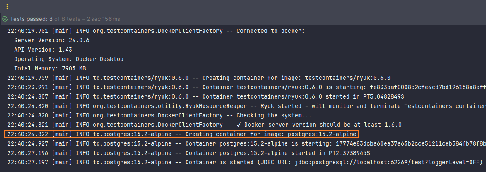

# [Getting started with Testcontainers in a Java Spring Boot Project](https://testcontainers.com/guides/testing-spring-boot-rest-api-using-testcontainers/)

Tutorial tomado de la página web oficial de **Testcontainers** con pequeños cambios realizados por mí.

### Qué vamos a conseguir en esta guía

Vamos a crear un proyecto `Spring Boot` utilizando `Spring Data JPA` junto con `Postgres` e implementaremos endpoints
API
REST con el que interactuaremos con los registros almacenados en la base de datos. Luego probaremos esos endpoints
usando el módulo `Testcontainers`, `Postgres` y `TestRestTemplate`.

# Creando Aplicación Base

---

## Dependencias iniciales

````xml
<!--Spring Boot 3.2.3-->
<!--Java 21-->
<dependencies>
    <dependency>
        <groupId>org.springframework.boot</groupId>
        <artifactId>spring-boot-starter-data-jpa</artifactId>
    </dependency>
    <dependency>
        <groupId>org.springframework.boot</groupId>
        <artifactId>spring-boot-starter-web</artifactId>
    </dependency>

    <dependency>
        <groupId>org.postgresql</groupId>
        <artifactId>postgresql</artifactId>
        <scope>runtime</scope>
    </dependency>
    <dependency>
        <groupId>org.projectlombok</groupId>
        <artifactId>lombok</artifactId>
        <optional>true</optional>
    </dependency>
    <dependency>
        <groupId>org.springframework.boot</groupId>
        <artifactId>spring-boot-starter-test</artifactId>
        <scope>test</scope>
    </dependency>
</dependencies>
````

## Configurando application.yml

El archivo de propiedades principal `src/main/resources/application.yml` contendrá las configuraciones que requiere
nuestra aplicación para su funcionamiento.

En este archivo definimos la conexión a la base de datos real `db_production` con el que trabajará nuestra aplicación,
además del puerto en el que se estará ejecutando y otras configuraciones adicionales.

Es importante notar que estamos usando la propiedad `spring.sql.init.mode=always` con el que habilitamos la
inicialización del esquema, es decir, con esa configuración estamos habilitando la ejecución de los
archivos `schema.sql` y `data.sql`.

Ahora, podríamos haber definido las configuraciones propias de `jpa/hibernate` (`spring.jpa.hibernate.ddl-auto=update`)
para que nos cree a partir de las clases java de entidad las tablas en la base de datos, pero, en esta ocasión usaremos
los archivos `schema.sql` y `data.sql`, así que omitimos esa configuración y únicamente dejamos la configuración
`spring.sql.init.mode=always`.

````yml
server:
  port: 8080
  error:
    include-message: always

spring:
  application:
    name: spring-boot-testcontainers

  datasource:
    url: jdbc:postgresql://localhost:5432/db_production
    username: postgres
    password: magadiflo

  sql:
    init:
      mode: always

  jpa:
    properties:
      hibernate:
        format_sql: true

logging:
  level:
    org.hibernate.SQL: DEBUG            # Permite ver la consulta SQL en consola
    org.hibernate.orm.jdbc.bind: TRACE  # Permite ver los parámetros de la consulta SQL
````

## Agregando script de creación de squema y poblamiento de tabla

Como no utilizamos ninguna base de datos en memoria, necesitamos crear las tablas de la base de datos de Postgres de
alguna manera. El enfoque recomendado es utilizar alguna herramienta de migración de bases de datos como `Flyway` o
`Liquibase`, pero para esta guía utilizaremos el soporte de inicialización de esquema simple proporcionado por Spring
Boot.

Cree un archivo `schema.sql` con el siguiente contenido en el directorio `src/main/resources`.

````sql
CREATE TABLE IF NOT EXISTS customers(
    id BIGSERIAL PRIMARY KEY,
    name VARCHAR NOT NULL,
    email VARCHAR NOT NULL UNIQUE
);
````

Cree el archivo `data.sql` para insertar registros en el esquema anterior:

````sql
TRUNCATE TABLE customers RESTART IDENTITY;

INSERT INTO customers(name, email)
VALUES('John Doe', 'john.doe@example.com'),
('Alice Smith', 'alice.smith@example.com'),
('Bob Johnson', 'bob.johnson@example.com'),
('Emily Davis', 'emily.davis@example.com'),
('Michael Brown', 'michael.brown@example.com'),
('Emma Wilson', 'emma.wilson@example.com'),
('Daniel Taylor', 'daniel.taylor@example.com'),
('Olivia Martinez', 'olivia.martinez@example.com'),
('James Anderson', 'james.anderson@example.com'),
('Sophia Rodriguez', 'sophia.rodriguez@example.com'),
('William Garcia', 'william.garcia@example.com'),
('Ava Lopez', 'ava.lopez@example.com'),
('Alexander Perez', 'alexander.perez@example.com'),
('Charlotte Gonzalez', 'charlotte.gonzalez@example.com'),
('Mason Sanchez', 'mason.sanchez@example.com'),
('Amelia Ramirez', 'amelia.ramirez@example.com'),
('Ethan Torres', 'ethan.torres@example.com'),
('Isabella Flores', 'isabella.flores@example.com'),
('Liam Rivera', 'liam.rivera@example.com'),
('Mia Cruz', 'mia.cruz@example.com'),
('Noah Diaz', 'noah.diaz@example.com'),
('Harper Stewart', 'harper.stewart@example.com'),
('Benjamin Murphy', 'benjamin.murphy@example.com'),
('Evelyn Coleman', 'evelyn.coleman@example.com'),
('Logan Reed', 'logan.reed@example.com'),
('Avery Bailey', 'avery.bailey@example.com'),
('Jacob Butler', 'jacob.butler@example.com'),
('Sofia Garcia', 'sofia.garcia@example.com'),
('Elijah Roberts', 'elijah.roberts@example.com'),
('Aria Martinez', 'aria.martinez@example.com'),
('Oliver Perez', 'oliver.perez@example.com'),
('Chloe Adams', 'chloe.adams@example.com'),
('William Scott', 'william.scott@example.com'),
('Scarlett Foster', 'scarlett.foster@example.com'),
('Lucas Price', 'lucas.price@example.com'),
('Layla Evans', 'layla.evans@example.com'),
('Michael Long', 'michael.long@example.com'),
('Grace Lee', 'grace.lee@example.com'),
('Jackson King', 'jackson.king@example.com'),
('Riley Hughes', 'riley.hughes@example.com'),
('Lily Nguyen', 'lily.nguyen@example.com'),
('Aiden Thompson', 'aiden.thompson@example.com'),
('Zoe Mitchell', 'zoe.mitchell@example.com'),
('Henry Cook', 'henry.cook@example.com'),
('Audrey White', 'audrey.white@example.com');
````

## Creando Entidad JPA

Vamos a trabajar con la entidad JPA llamada `Customer`

````java

@AllArgsConstructor
@NoArgsConstructor
@Builder
@Data
@Entity
@Table(name = "customers")
public class Customer {
    @Id
    @GeneratedValue(strategy = GenerationType.IDENTITY)
    private Long id;
    @Column(nullable = false)
    private String name;
    @Column(nullable = false, unique = true)
    private String email;
}
````

## Creando Spring Data JPA Repository

Spring Data JPA es una abstracción además de JPA y proporciona operaciones CRUD básicas, capacidades de clasificación y
paginación y generación dinámica de consultas a partir de nombres de métodos.

Creemos una interfaz de repositorio Spring Data JPA para la entidad `Cusotmer`. Además, crearemos un método
personalizado con el que obtendremos un `Customer` a partir de su email:

````java
public interface CustomerRepository extends JpaRepository<Customer, Long> {
    Optional<Customer> findCustomerByEmail(String email);
}
````

## Creando Servicios

Como buena práctica, creamos la capa de servicio con el que implementaremos los métodos para interactuar con el
repositorio de Customer:

````java
public interface CustomerService {
    List<Customer> findAllCustomers();

    Optional<Customer> findCustomerById(Long id);

    Optional<Customer> findCustomerByEmail(String email);

    Customer saveCustomer(Customer customer);

    Optional<Customer> updateCustomer(Long id, Customer customer);

    Optional<Boolean> deleteCustomerById(Long id);
}
````

````java

@RequiredArgsConstructor
@Slf4j
@Service
public class CustomerServiceImpl implements CustomerService {

    private final CustomerRepository customerRepository;

    @Override
    @Transactional(readOnly = true)
    public List<Customer> findAllCustomers() {
        return this.customerRepository.findAll();
    }

    @Override
    @Transactional(readOnly = true)
    public Optional<Customer> findCustomerById(Long id) {
        return this.customerRepository.findById(id);
    }

    @Override
    @Transactional(readOnly = true)
    public Optional<Customer> findCustomerByEmail(String email) {
        return this.customerRepository.findCustomerByEmail(email);
    }

    @Override
    @Transactional
    public Customer saveCustomer(Customer customer) {
        return this.customerRepository.save(customer);
    }

    @Override
    @Transactional
    public Optional<Customer> updateCustomer(Long id, Customer customer) {
        return this.customerRepository.findById(id)
                .map(customerDB -> {
                    customerDB.setName(customer.getName());
                    customerDB.setEmail(customer.getEmail());
                    return customerDB;
                })
                .map(this.customerRepository::save);
    }

    @Override
    @Transactional
    public Optional<Boolean> deleteCustomerById(Long id) {
        return this.customerRepository.findById(id)
                .map(customerDB -> {
                    this.customerRepository.deleteById(id);
                    return true;
                });
    }
}
````

## Creando endpoints API REST

Finalmente, cree un controlador para implementar los endpoints API REST utilizando todos los métodos implementados en la
capa de servicio de Customer:

````java

@RequiredArgsConstructor
@Slf4j
@RestController
@RequestMapping(path = "/api/v1/customers")
public class CustomerRestController {

    private final CustomerService customerService;

    @GetMapping
    public ResponseEntity<List<Customer>> listAllCustomers() {
        return ResponseEntity.ok(this.customerService.findAllCustomers());
    }

    @GetMapping(path = "/{id}")
    public ResponseEntity<Customer> getCustomerById(@PathVariable Long id) {
        return this.customerService.findCustomerById(id)
                .map(ResponseEntity::ok)
                .orElseGet(() -> ResponseEntity.notFound().build());
    }

    @GetMapping(path = "/email/{email}")
    public ResponseEntity<Customer> getCustomerByEmail(@PathVariable String email) {
        return this.customerService.findCustomerByEmail(email)
                .map(ResponseEntity::ok)
                .orElseGet(() -> ResponseEntity.notFound().build());
    }

    @PostMapping
    public ResponseEntity<Customer> saveCustomer(@RequestBody Customer customer) {
        Customer customerDB = this.customerService.saveCustomer(customer);
        URI location = URI.create("/api/v1/customers/" + customerDB.getId());
        return ResponseEntity.created(location).body(customerDB);
    }

    @PutMapping(path = "/{id}")
    public ResponseEntity<Customer> updateCustomer(@PathVariable Long id, @RequestBody Customer customer) {
        return this.customerService.updateCustomer(id, customer)
                .map(ResponseEntity::ok)
                .orElseGet(() -> ResponseEntity.notFound().build());
    }

    @DeleteMapping(path = "/{id}")
    public ResponseEntity<Void> deleteCustomer(@PathVariable Long id) {
        return this.customerService.deleteCustomerById(id)
                .map(wasDeleted -> new ResponseEntity<Void>(HttpStatus.NO_CONTENT))
                .orElseGet(() -> ResponseEntity.notFound().build());
    }
}
````

## Probando Endpoints

Hasta este punto se hicieron las pruebas y todos los endpoints están funcionando correctamente. Solo por documentación
mostraré los resultados obtenidos al consultar algunos endpoints:

````bash
$ curl -v http://localhost:8080/api/v1/customers | jq

>
< HTTP/1.1 200
<
[
  {
    "id": 1,
    "name": "John Doe",
    "email": "john.doe@example.com"
  },
  {...}
]
````

````bash
$ curl -v http://localhost:8080/api/v1/customers/email/michael.brown@example.com | jq

>
< HTTP/1.1 200
<
{
  "id": 5,
  "name": "Michael Brown",
  "email": "michael.brown@example.com"
}
````

````bash
$ curl -v -X POST -H "Content-Type: application/json" -d "{\"name\": \"martin\", \"email\": \"martin@gmail.com\"}" http://localhost:8080/api/v1/customers | jq

< HTTP/1.1 201
<
{
  "id": 46,
  "name": "martin",
  "email": "martin@gmail.com"
}
````

---

# Escribiendo Test Para EndPoints API REST

---

Empezaremos a escribir las pruebas a los distintos endpoints de nuestra aplicación, pero para eso, primero debemos
agregar las siguientes dependencias:

````xml

<dependencies>
    <dependency>
        <groupId>org.springframework.boot</groupId>
        <artifactId>spring-boot-testcontainers</artifactId>
        <scope>test</scope>
    </dependency>
    <dependency>
        <groupId>org.testcontainers</groupId>
        <artifactId>junit-jupiter</artifactId>
        <scope>test</scope>
    </dependency>
    <dependency>
        <groupId>org.testcontainers</groupId>
        <artifactId>postgresql</artifactId>
        <scope>test</scope>
    </dependency>
</dependencies>
````

Utilizando `Spring Initializr` y teniendo las dependencias iniciales aún en la web, agregamos una dependencia más,
me refiero a la dependencia `Testcontainers`, al agregar dicha dependencia, en automático se agregan dos dependencias
más: `junit-jupiter` y `postgresql`, ambos con **groupId** `org.testcontainers`.

**La dependencia `Testcontainers` proporcione instancias ligeras y desechables de bases de datos comunes,
navegadores web Selenium o cualquier otra cosa que pueda ejecutarse en un contenedor Docker.**

## Creando recursos de test

Crearemos el directorio **resources** de esta manera `src/test/resources`, dentro de él crearemos los `scripts` para
la creación de la tabla y poblamiento de datos en la base de datos de test.

`src/test/resources/schema.sql`

````sql
CREATE TABLE IF NOT EXISTS customers(
    id BIGSERIAL PRIMARY KEY,
    name VARCHAR NOT NULL,
    email VARCHAR NOT NULL UNIQUE
);
````

`src/test/resources/data.sql`

````sql
TRUNCATE TABLE customers RESTART IDENTITY;

INSERT INTO customers(name, email)
VALUES('María Briones', 'maria.briones@gmail.com'),
('Karito Casanova', 'karito.casanova@gmail.com'),
('Luis Castillo', 'luis.castillo@gmail.com'),
('Diego Campomanes', 'diego.campomanes@gmail.com'),
('Alexander Villanueva', 'alexander.villanueva@gmail.com');
````

## Configuración Manual - Escribiendo Test al controlador CustomerRestController

Nos ubicamos dentro del controlador `CustomerRestController` y presionamos `Ctrl + Shift + T` y `Create New Test...`,
con esto se nos creará una clase de prueba para nuestro controlador.

Pero para iniciar con éxito nuestro contexto Spring necesitamos una base de datos Postgres en funcionamiento y
configurar el contexto para comunicarse con esa base de datos. `Aquí es donde Testcontainers entra en escena`.

Podemos usar la biblioteca `Testcontainers` para activar una instancia de base de datos Postgres como un contenedor
Docker y configurar la aplicación para comunicarse con esa base de datos de la siguiente manera:

````java
/**
 * Configuración Manual
 * ********************
 * <p>
 * Somos nosotros los que le decimos cuándo debemos iniciar el contenedor, cuándo detenerse
 * y además agregar ciertas configuraciones dinámicas usando la anotación @DynamicPropertySource
 */
@Sql(scripts = {"/data.sql"}, executionPhase = Sql.ExecutionPhase.BEFORE_TEST_METHOD)
@SpringBootTest(webEnvironment = SpringBootTest.WebEnvironment.RANDOM_PORT)
class CustomerRestControllerManualConfigTest {
    private static final PostgreSQLContainer<?> POSTGRES_CONTAINER = new PostgreSQLContainer<>("postgres:15.2-alpine");
    private static final String CUSTOMERS_ENDPOINT_PATH = "/api/v1/customers";
    @Autowired
    private TestRestTemplate restTemplate;

    @BeforeAll
    static void beforeAll() {
        POSTGRES_CONTAINER.start(); // Le indicamos que debe iniciar el contenedor
    }

    @AfterAll
    static void afterAll() {
        POSTGRES_CONTAINER.stop();  // Le indicamos que debe detener el contenedor y eliminarlo
    }

    @DynamicPropertySource
    static void configureProperties(DynamicPropertyRegistry registry) {
        registry.add("spring.datasource.url", POSTGRES_CONTAINER::getJdbcUrl);
        registry.add("spring.datasource.username", POSTGRES_CONTAINER::getUsername);
        registry.add("spring.datasource.password", POSTGRES_CONTAINER::getPassword);
    }

    @Test
    void connectionEstablished() {
        Assertions.assertThat(POSTGRES_CONTAINER.isCreated()).isTrue();
        Assertions.assertThat(POSTGRES_CONTAINER.isRunning()).isTrue();
    }

    @Test
    void shouldGetAllCustomers() {
        Customer[] customersResponse = this.restTemplate.getForObject(CUSTOMERS_ENDPOINT_PATH, Customer[].class);
        Assertions.assertThat(customersResponse.length).isEqualTo(5);
    }

    @Test
    void shouldFindCustomerWhenValidCustomerId() {
        ResponseEntity<Customer> response = this.restTemplate.exchange(CUSTOMERS_ENDPOINT_PATH + "/{id}", HttpMethod.GET, null, Customer.class, Collections.singletonMap("id", 1));
        Assertions.assertThat(response.getStatusCode()).isEqualTo(HttpStatus.OK);
        Assertions.assertThat(response.getBody()).isNotNull();
    }

    @Test
    void shouldFindCustomerWhenEmailIsValid() {
        ResponseEntity<Customer> response = this.restTemplate.exchange(CUSTOMERS_ENDPOINT_PATH + "/email/{email}", HttpMethod.GET, null, Customer.class, Collections.singletonMap("email", "karito.casanova@gmail.com"));
        Assertions.assertThat(response.getStatusCode()).isEqualTo(HttpStatus.OK);
        Assertions.assertThat(response.getBody()).isNotNull();
    }

    @Test
    void shouldThrowNotFoundWhenEmailIsInvalid() {
        ResponseEntity<Customer> response = this.restTemplate.exchange(CUSTOMERS_ENDPOINT_PATH + "/email/{email}", HttpMethod.GET, null, Customer.class, Collections.singletonMap("email", "karito.casanova@outlook.com"));
        Assertions.assertThat(response.getStatusCode()).isEqualTo(HttpStatus.NOT_FOUND);
    }

    @Test
    void shouldCreateNewCustomer() {
        Customer customerRequest = Customer.builder()
                .name("Rosita Pardo")
                .email("rosita.pardo@gmail.com")
                .build();
        ResponseEntity<Customer> response = this.restTemplate.exchange(CUSTOMERS_ENDPOINT_PATH, HttpMethod.POST, new HttpEntity<>(customerRequest), Customer.class);

        Assertions.assertThat(response.getStatusCode()).isEqualTo(HttpStatus.CREATED);
        Assertions.assertThat(response.getBody()).isNotNull();
        Assertions.assertThat(response.getBody().getId()).isEqualTo(6);
        Assertions.assertThat(response.getBody().getName()).isEqualTo(customerRequest.getName());
        Assertions.assertThat(response.getBody().getEmail()).isEqualTo(customerRequest.getEmail());
    }

    @Test
    void shouldUpdateCustomerWhenCustomerIsValid() {
        Customer customerToUpdate = Customer.builder()
                .name("Karol Casanova Mas Naa")
                .email("karito.casanova@outlook.com")
                .build();
        ResponseEntity<Customer> response = this.restTemplate.exchange(CUSTOMERS_ENDPOINT_PATH + "/{id}", HttpMethod.PUT, new HttpEntity<>(customerToUpdate), Customer.class, Collections.singletonMap("id", 1));

        Assertions.assertThat(response.getStatusCode()).isEqualTo(HttpStatus.OK);
        Assertions.assertThat(response.getBody()).isNotNull();
        Assertions.assertThat(response.getBody().getId()).isEqualTo(1);
        Assertions.assertThat(response.getBody().getName()).isEqualTo(customerToUpdate.getName());
        Assertions.assertThat(response.getBody().getEmail()).isEqualTo(customerToUpdate.getEmail());
    }

    @Test
    void shouldDeleteCustomerWithValidId() {
        ResponseEntity<Void> response = this.restTemplate.exchange(CUSTOMERS_ENDPOINT_PATH + "/{id}", HttpMethod.DELETE, null, Void.class, Collections.singletonMap("id", 1));
        Assertions.assertThat(response.getStatusCode()).isEqualTo(HttpStatus.NO_CONTENT);
    }
}
````

Entendamos qué está pasando en esta prueba.

- La anotación `@Sql` se utiliza para anotar una clase de prueba o un método de prueba para configurar scripts y
  declaraciones SQL que se ejecutarán en una base de datos determinada durante las pruebas de integración. **Esta
  configuración nos garantizará una configuración de datos predecibles para cada prueba y evitará cualquier tipo de
  contaminación en las pruebas.**


- Hemos anotado la clase de prueba con la anotación `@SpringBootTest` junto con la configuración `webEnvironment`, de
  modo que la prueba se ejecutará iniciando toda la aplicación en un puerto disponible aleatorio.


- Hemos creado una instancia de `PostgreSQLContainer` usando la imagen de Docker `postgres:15.2-alpine`.
  El `contenedor de Postgres se inicia` utilizando el método de devolución de llamada `JUnit 5 @BeforeAll` que se
  ejecuta antes de ejecutar cualquier método de prueba dentro de una instancia de prueba.


- Utilizamos el `@AfterAll`  para indicar que el método anotado debe ejecutarse después de todas las pruebas en la clase
  de prueba actual. A diferencia de los métodos @AfterEach, los métodos `@AfterAll` solo se ejecutan una vez para una
  clase de prueba determinada. Dentro del método anotado con `@AfterAll` usamos la función `.stop()` de la instancia de
  `PostgreSQLContainer` para matar y retirar el contendor.


- La base de datos de `Postgres` se ejecuta en el puerto `5432` dentro del contenedor y se asigna a
  un `puerto disponible aleatorio` en el host.


- Hemos registrado las propiedades de conexión de la base de datos **obtenidas dinámicamente del contenedor de
  Postgres** utilizando `DynamicPropertyRegistry` de Spring Boot.


- La anotación `@DynamicPropertySource` es una anotación a nivel de método para pruebas de integración que necesitan
  agregar propiedades con valores dinámicos al conjunto de PropertySources del entorno.
  Esta anotación y su infraestructura de soporte se diseñaron originalmente para permitir que las propiedades de las
  pruebas basadas en `Testcontainers` se expongan fácilmente a las pruebas de integración de Spring. Sin embargo, esta
  característica también se puede utilizar con cualquier forma de recurso externo cuyo ciclo de vida se mantenga fuera
  del ApplicationContext de la prueba.
  Los métodos anotados con `@DynamicPropertySource` deben ser estáticos y deben tener un único argumento
  `DynamicPropertyRegistry` que se utiliza para agregar pares `nombre-valor` al conjunto de `PropertySources` del
  entorno. Los valores son dinámicos y se proporcionan a través de `java.util.function.Supplier` que solo se invoca
  cuando se resuelve la propiedad. Normalmente, las referencias de métodos se utilizan para proporcionar valores.
  <br><br>
  A continuación mostramos el trozo de código donde hacemos uso de la configuración del datasource de prueba:

  ````java
  
  @DynamicPropertySource
  static void configureProperties(DynamicPropertyRegistry registry) {
      registry.add("spring.datasource.url", POSTGRES_CONTAINER::getJdbcUrl);
      registry.add("spring.datasource.username", POSTGRES_CONTAINER::getUsername);
      registry.add("spring.datasource.password", POSTGRES_CONTAINER::getPassword);
  }
  ````
  Se muestra a continuación los valores que toman cada `get`:

    - **getJdbcUrl**,  `jdbc:postgresql://localhost:61126/test?loggerLevel=OFF`, donde el puerto es aleatorio, es decir,
      cambiará con cada ejecución de pruebas. Notar que el nombre de la base de datos que se crea es `test`.
    - **getUsername**, devuelve el valor `test`.
    - **getPassword**, devuelve el valor `test`.


- Finalmente, en cada método test hacemos uso del cliente `TestRestTemplate` con el que realizamos las
  solicitudes `HttpRequest` y evaluamos el resultado según sea el caso.

**NOTA**  
Para ver más detalles del uso de la anotación `@Sql` visitar el siguiente proyecto
[spring-boot-test](https://github.com/magadiflo/spring-boot-test.git)

## Ejecutando tests

Debería ver que el contenedor acoplable de `Postgres` está iniciado y todas las pruebas deberían `PASAR`. También puede
observar que **después de ejecutar las pruebas, los contenedores se detienen y se eliminan automáticamente.**

En la siguiente imagen vemos que al iniciar el test, nuestra aplicación se conecta a `Docker` de nuestra máquina local y
obtiene cierta información.


Luego, empieza a crear el contenedor necesario para ejecutar los tests a partir de la imagen que definimos, en nuestro
caso a partir de la imagen de postgres `postgres:15.2-alpine`:



A continuación empieza a iniciarse la aplicación, observar que para la realización de estas pruebas la aplicación se
está iniciando en un puerto aleatorio `62287`:


Finalmente, vemos que todos los tests es han ejecutado exitosamente:


## Resumen

La biblioteca `Testcontainers` nos ayudó a escribir pruebas de integración utilizando el mismo tipo de base de datos,
`Postgres`, que usamos en producción en lugar de Mocks o bases de datos en memoria.

Para obtener más información sobre Testcontainers, visite http://testcontainers.com

